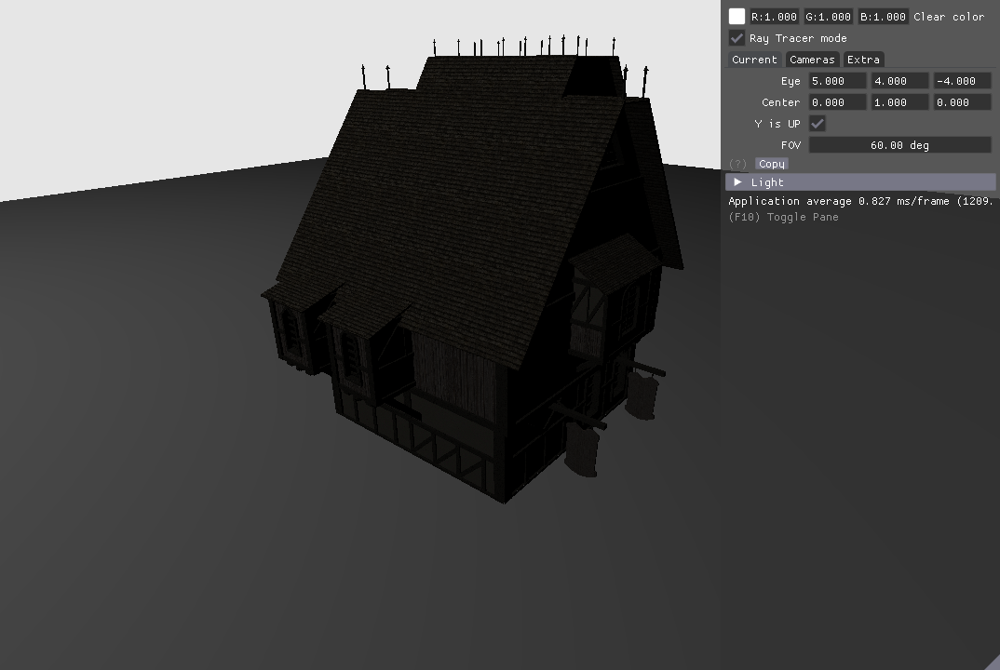
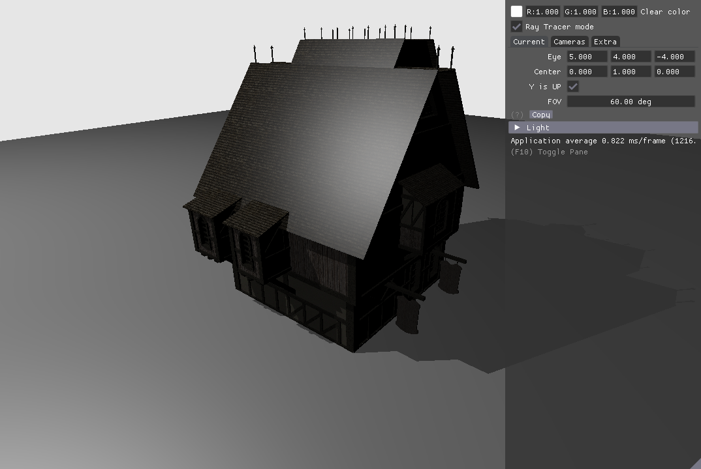

# Bad rendering when rmiss linked in with rchit

When all four shader stages are linked into one SPIR-V module, the TraceRay function the rchit sends out always comes back with a shadow hit, meaning the rmiss_shadow is never invoked to clear its shadow flag.

When the rmiss_shadow kernel is linked into a separate module _and is not also in the module containing the other kernels_, the shadow query works:

There are bugs in `spirv-link` preventing me from using linking .spv files that came with this sample. The included modules were generated by Circle. Try linking your own modules together (assuming you can get `spirv-link` to work) and I'm sure you'll see the same thing. I reported a bug very similar back in Oct that dealt with rhit/rint in the same module.

My gut tells me this is a problem when multiple rmiss are in the same module.

The three modules are [ray_tracing__simple/shaders/linked_no_shadow.spv], [ray_tracing__simple/shaders/linked_all.spv] and [ray_tracing__simple/shaders/rmiss_shadow.spv]. In [ray_tracing__simple/hello_vulkan.cpp], use the macros:
* `USE_DEFAULT` - the separate modules compiled by the sample framework
* `USE_LINKED_SEPARATE` - two Circle-generated modules. rgen, rchit and rmiss are in linked_no_shadow.spv. rmiss_shadow is in rmiss_shadow.spv.
* `USE_LINKED_TOGETHER` - one Circle-generate module with all four shaders. This is the broken one.
* 